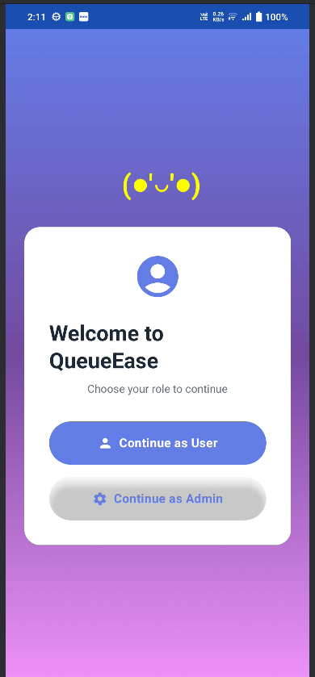
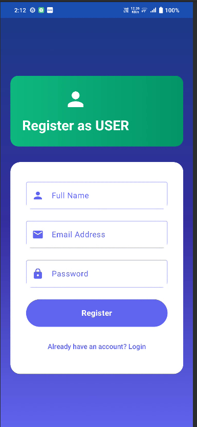
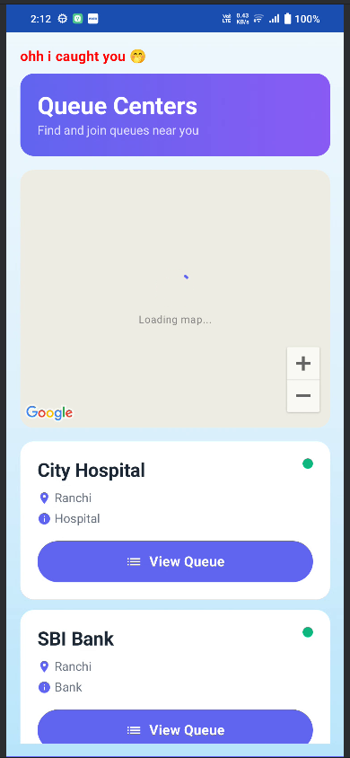
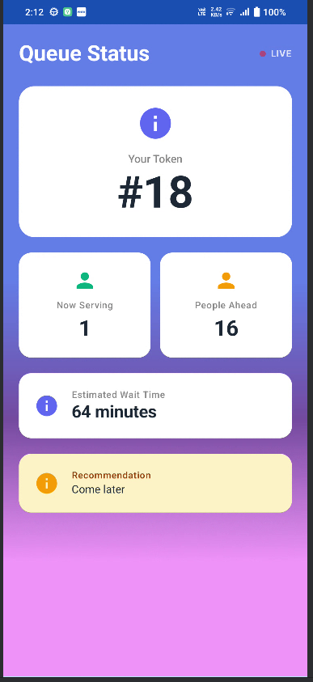
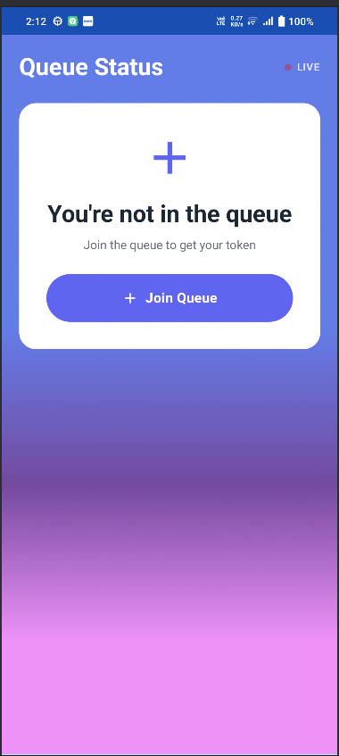
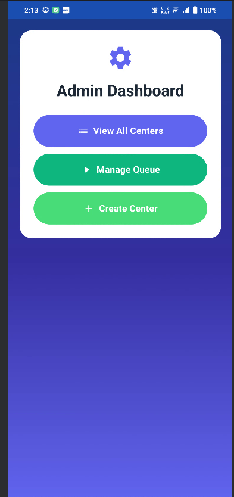
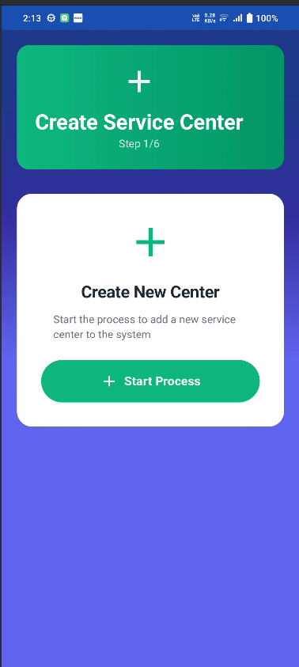
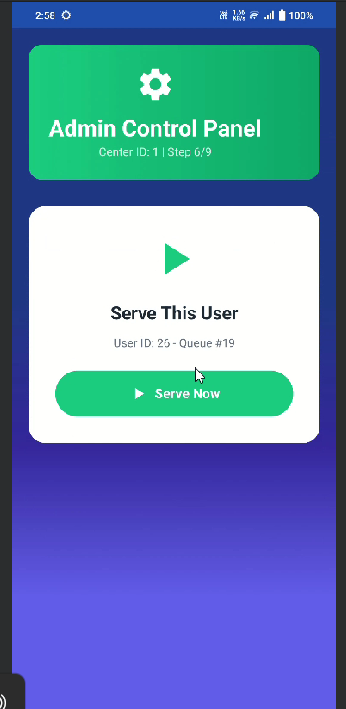

# 🚀 QueueEase – Smart Queue Management System

QueueEase is a mobile-based queue management system that reduces physical waiting time by allowing users to join queues remotely and track real-time status.

---

## 📱 Features

- 🔐 JWT-based secure authentication
- 📍 Location-based center discovery (Google Maps)
- ⏱️ Real-time queue status updates
- 👥 Role-based access (User/Admin)
- 📊 Efficient queue handling system

---

## 🛠️ Tech Stack

- **Frontend:** Android (Kotlin, Jetpack Compose)
- **Backend:** Spring Boot (Java)
- **Databases:** MySQL + MongoDB
- **Networking:** REST APIs (Retrofit)
- **Maps:** Google Maps API

---

## 🎥 Demo Video

👉 [Watch Demo](PASTE_YOUR_YOUTUBE_LINK_HERE)

---

## 📸 Screenshots
### 🔐 RoleSelection

### 🔐 Login as User

### 🏠 Center list

### 🏠 Queue Status

### ➕ Join Queue

### 📊 Admin Dashboard

### 📊 Create_Center_Screen

### 📊 Admin Dashboard

---

## ⚙️ How It Works

1. User logs in
2. Selects nearest service center
3. Joins queue remotely
4. Tracks live queue status
5. Admin manages queue flow

---

## 🔗 Backend Repository

👉 https://github.com/Manshi-vatsa/queueease-backend

---

## 🚀 Future Improvements

- Real-time updates using WebSockets
- Push notifications for queue turn
- Deployment on cloud infrastructure

---

## 👩‍💻 Author

Manshi Vatsa